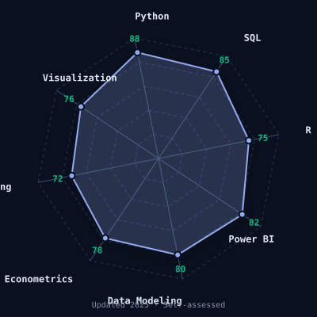
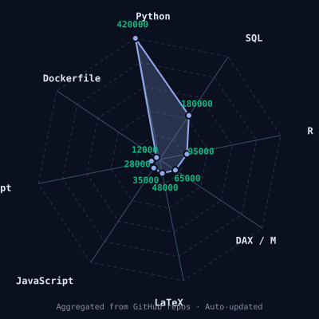
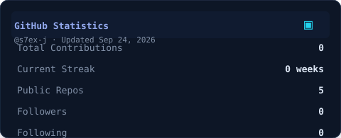
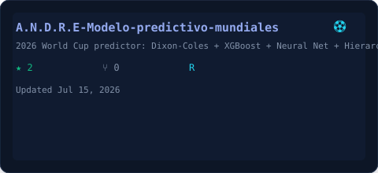

<!-- BANNER -->
<picture>
  <source media="(prefers-color-scheme: dark)"  srcset="assets/banner-dark.svg">
  <source media="(prefers-color-scheme: light)"  srcset="assets/banner-light.svg">
  
</picture>

 

<!-- NAME / TAGLINE -->

 

<!-- SOCIALS -->

 

---

  
📚 Tabla de Contenidos

  
  - [This is me :)](#this-is-me-)
  - [Building](#building)
  - [Thinking about](#thinking-about)
  - [Skillset Radar](#skillset-radar)
  - [Pulse](#pulse)
  - [Featured Work](#featured-work)
  - [Words](#words)
  - [Now](#now)
  

## This is me :)

Hi, I'm **Andre**, double-degree student in Industrial Engineering and Data Science, broadcasting from Lima, Perú 🇵🇪.
I build models and dashboards that turn messy operational data into pricing decisions and forecasts — mostly at the intersection of econometrics and machine learning.

I'm a restless reader: I devour papers on AI fairness, behavioral economics, psychology of decision-making, environmental engineering, legal informatics, and fitness science — whatever catches my attention today.

- 🎓 **Student**: Industrial Engineering + Data Science (dual track)
- 📍 **Based in**: Lima, Perú
- 🏢 **Target role**: Analista de Datos Junior / Practicante BI
- 📊 **Daily driver**: Power BI, SQL, Python (Pandas, scikit-learn, statsmodels), DAX
- 🧪 **Research interests**: Price-demand elasticity, ensemble stacking for sports prediction, behavioral demand drivers, causal inference
- 📝 **Academic writing**: LaTeX (IEEE, APA 7), published on [Zenodo](https://doi.org/10.5281/zenodo.21709748) and [ResearchGate](https://www.researchgate.net/profile/Jharol-Vilca-Ramos)
- 📚 **Currently reading**: Papers on AI ethics, decision neuroscience, environmental sustainability, legal AI — anything that lets me complicate mi vida un poco más.

 

## 🔮 Building

| Project | Description | Status | Stack |
|---|---|---|---|
| `A.N.D.R.E.` | Ensemble stacking predictor for football matches (World Cup 2026) | ⚡ Active | Python · XGBoost · LightGBM · Optuna |
| `dophamine` | Behavioral economics toolkit for demand analysis and elasticity estimation | 🛠️ Prototyping | Python · statsmodels · behavioral economics |
| `LaTeX Templates` | Academic writing templates following IEEE and APA 7 standards | ✅ Maintenance | LaTeX · IEEE · APA 7 |

---

## 💡 Thinking about

Right now, Andre is deep-diving into:
- **Behavioral demand drivers** — how psychology bends price elasticity
- **Causal inference in retail** — counterfactuals for pricing strategy  
- **xG/football analytics** — ensemble methods for match prediction
- **AI in legal docs** — NLP for contract analysis (side quest)
- **Decision neuroscience** — what the brain tells us about choice

 

---

## my perfect stack

---

## 🧩 Skillset Radar

<table>
<tr>
<td width="50%" align="center" valign="middle">

<!-- Self-rated radar - edit assets/skills.json -->
<picture>
  <source media="(prefers-color-scheme: dark)"  srcset="assets/radar-dark.svg">
  <source media="(prefers-color-scheme: light)"  srcset="assets/radar-light.svg">
  
</picture>

</td>
<td width="50%" align="center" valign="middle">

<!-- Language mix radar - edit assets/langmix.json -->
<picture>
  <source media="(prefers-color-scheme: dark)"  srcset="assets/radar-langs-dark.svg">
  <source media="(prefers-color-scheme: light)"  srcset="assets/radar-langs-light.svg">
  
</picture>

</td>
</tr>
</table>

---

## 📊 Pulse

<!-- Generated by scripts/cards.py - no external dependencies -->
<picture>
  <source media="(prefers-color-scheme: dark)"  srcset="assets/card-stats-dark.svg">
  <source media="(prefers-color-scheme: light)"  srcset="assets/card-stats-light.svg">
  
</picture>

 

<picture>
  <source media="(prefers-color-scheme: dark)"  srcset="assets/metrics.languages-dark.svg">
  <source media="(prefers-color-scheme: light)"  srcset="assets/metrics.languages-light.svg">
  
</picture>

---

## 🌟 Featured Work

<table>
<tr>
<td width="33%" align="center" valign="top">

<!-- Repo card 0 -->
<picture>
  <source media="(prefers-color-scheme: dark)"  srcset="assets/card-repo-0-dark.svg">
  <source media="(prefers-color-scheme: light)"  srcset="assets/card-repo-0-light.svg">
  
</picture>

</td>
<td width="33%" align="center" valign="top">

<!-- Repo card 1 -->
<picture>
  <source media="(prefers-color-scheme: dark)"  srcset="assets/card-repo-1-dark.svg">
  <source media="(prefers-color-scheme: light)"  srcset="assets/card-repo-1-light.svg">
  
</picture>

</td>
<td width="33%" align="center" valign="top">

<!-- Repo card 2 -->
<picture>
  <source media="(prefers-color-scheme: dark)"  srcset="assets/card-repo-2-dark.svg">
  <source media="(prefers-color-scheme: light)"  srcset="assets/card-repo-2-light.svg">
  
</picture>

</td>
</tr>
</table>

---

## 📚 Words

[Zenodo — Price-Demand Elasticity Paper](https://doi.org/10.5281/zenodo.21709748)  
[ResearchGate — Andre](https://www.researchgate.net/profile/Jharol-Vilca-Ramos)  
LaTeX templates for academic writing

---

## 🎯 Now

Finishing `A.N.D.R.E.` — World Cup 2026 predictor (v2)  
Writing LaTeX templates for data science reports  
Reading: decision neuroscience + behavioral economics papers  
Experimenting with causal ML for pricing recommendations  

